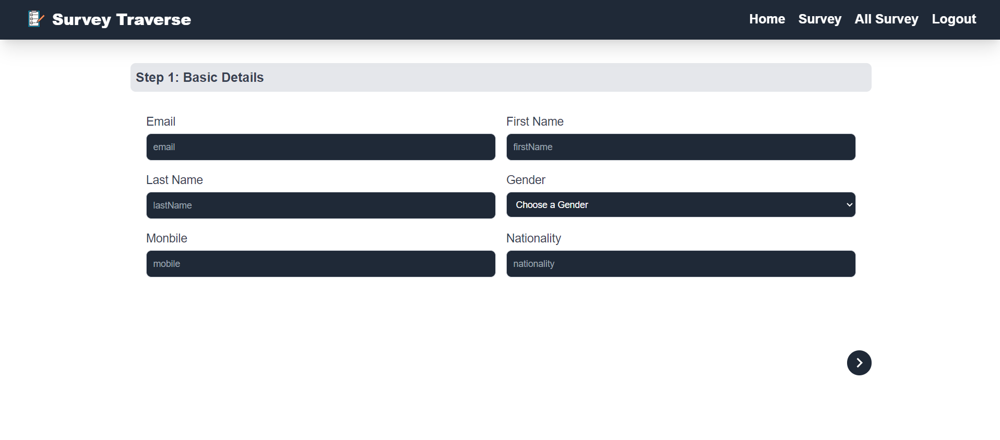
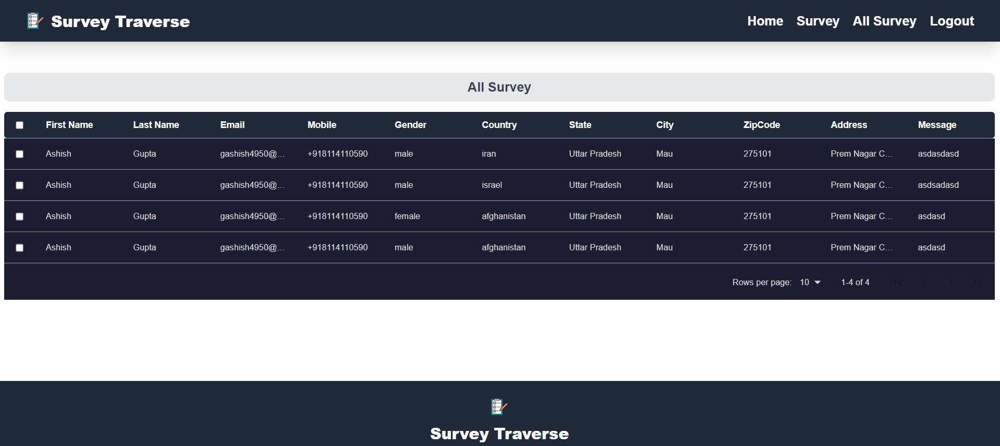

# React Survey Traverse- Using MERN STACK





React Survey Traverse- Using  React + Vite.
[Live Demo](https://survey-traverse.vercel.app)

## Tech Stack

**React, React-Router-Dom, Redux, ReduxToolkit, JavaScript, Tailwind, React-Icons, Axios, Nodejs, ExpressJs, JsonWebToken, MongoDB, Mongoose**

## Features

- **User can Give Survey by Filling the all the Details on page Survey**
- **List of All Survey at All Survey Page after Admin Login**
- **Authorization using JsonWebToken, Token stored in LocalStorage**
- **Admin Login Credentials: **
- *Email: admin@gmail.com*
- *Password: admin@123*

## Getting Started

First you need clone this project.

```bash
git clone https://github.com/se-ashishgupta/Survey-Traverse
```

Now You have to add .env file in both client and server in root of client and server.
And Now Fill This Given Variable

** Client **

```bash
VITE_SERVER_URI = http://localhost:8000/api/v1
```

** Server **
```bash
PORT = 8000
MONGO_URI= <MongoDB URI>
FRONTEND_URL = http://localhost:5173
JWT_SECRET = <Secret Key>
```

Now run the project..

** Client **
```bash
cd Survey-Traverse/client
npm install
npm run dev
```

** Server **
```bash
cd Survey-Traverse/server
npm install
nodemon server.js
```
